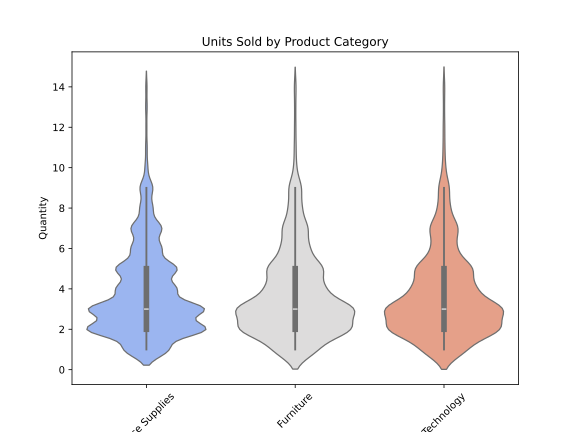

# Overview
This project creates a comprehensive sales analytics dashboard using Power BI with Python integration for advanced analytics. The dashboard provides insights into sales performance, profitability, customer behavior, and geographic trends.

# Prerequisites

- Power BI Desktop (free version)
- Python 3.7+ with the following packages:
  
  ```bash
  pip install pandas numpy matplotlib seaborn scikit-learn statsmodels
  ```

# Data Preparation
Python Cleaning Script
Create a data_preparation.py file:

```python

import pandas as pd

# Load and clean data
df = pd.read_csv('sales-data-sample.csv')
df['OrderDate'] = pd.to_datetime(df['OrderDate'])
df['Profit'] = pd.to_numeric(df['Profit'], errors='coerce')
df['ProfitMargin'] = df['Profit'] / df['Sales']

# Customer segmentation
def segment_customer(row):
    if row['Sales'] > 5000: return 'VIP'
    elif row['Sales'] > 2000: return 'Premium'
    else: return 'Regular'
    
df['CustomerSegment'] = df.apply(segment_customer, axis=1)
df.to_csv('processed_sales.csv', index=False)

```
# Power BI Dashboard Structure

- Page 1: Executive Summary

    - KPIs: Total Sales, Total Profit, Profit Margin, Avg Order Value

    - Monthly trend chart (line chart)

    - Sales by category (donut chart)

    - Top 5 customers by sales (bar chart)

 - Page 2: Product Performance

    - Sales by sub-category (treemap)

    - Profit margin heatmap (category vs sub-category)

    - Top/Bottom 10 products by profit (table)

 - Page 3: Geographic Analysis

    - Sales by region/state (map visualization)

    - City performance (bar chart)

    - Shipping performance by region (matrix)

 - Page 4: Customer Insights

    - Customer segmentation pie chart

    - Customer lifetime value analysis

    - Repeat purchase behavior

 # Implementing Advanced Analytics with Python
Use Python visuals within Power BI for advanced analytics:

   - Profitability Clustering (Python Visual):

```python
import matplotlib.pyplot as plt
import seaborn as sns
from sklearn.cluster import KMeans

# Prepare data
plot_data = dataset[['Sales', 'Profit']].dropna()
kmeans = KMeans(n_clusters=3).fit(plot_data)
plot_data['Cluster'] = kmeans.labels_

# Create plot
plt.figure(figsize=(8,6))
sns.scatterplot(x='Sales', y='Profit', hue='Cluster', data=plot_data, palette='viridis')
plt.title('Product Profitability Clusters')
plt.xlabel('Sales')
plt.ylabel('Profit')
plt.show()
```
 - Sales Forecasting (Python Visual):

```python
from statsmodels.tsa.arima.model import ARIMA
import matplotlib.dates as mdates

# Time series forecasting
ts_data = dataset.groupby('OrderDate')['Sales'].sum().reset_index()
ts_data = ts_data.set_index('OrderDate').asfreq('D').fillna(0)

model = ARIMA(ts_data, order=(7,0,5))
model_fit = model.fit()
forecast = model_fit.forecast(steps=30)

# Plot
plt.figure(figsize=(10,6))
plt.plot(ts_data.index, ts_data['Sales'], label='Historical')
plt.plot(forecast.index, forecast, label='Forecast', color='red')
plt.title('30-Day Sales Forecast')
plt.xlabel('Date')
plt.ylabel('Sales')
plt.legend()
plt.gcf().autofmt_xdate()
plt.show()
```

# Power BI Python Integration Steps

 - Import Data:
    - In Power BI, select "Get Data" → "Text/CSV" and choose your processed file
    - Alternatively, use Python script directly in Power BI:

```python
import pandas as pd
dataset = pd.read_csv('processed_sales_data.csv')
```
   - Create Calculated Measures:

```DAX
Total Sales = SUM('SalesData'[Sales])
Total Profit = SUM('SalesData'[Profit])
Profit Margin = DIVIDE([Total Profit], [Total Sales])
```
  - Add Python Visuals:
     - Click on the Python visual icon in the visualization panel
     - Drag the required fields into the "Values" section
     - Write your Python script in the editor
     
# Dashboard Interactivity

  - Implement these interactive features:
    - Cross-filtering: Click on any visual to filter others
    - Drill-through: From category → sub-category → product
    - Tooltips: Enhanced tooltips with additional metrics
    - Bookmarks: For different view states (e.g., regional view vs national view)

  - Step-by-Step Implementation:
    - Cross-filtering between visuals:
  
```powerquery
// Ensure relationships exist in Data Model
// Sales[ProductID] → Products[ProductID]
// Sales[CustomerID] → Customers[CustomerID]
```
   - Drill-through hierarchy:
```powerquery
// Create drill hierarchy in Data View:
1. Right-click "Region" field → "Create Hierarchy"
2. Add "State" and "City" to hierarchy
3. Use in map visual with drill controls enabled
```
   - Advanced tooltip configuration:
```powerquery
// Tooltip page measures:
Product TT Sales = SUM(Sales[Amount])
Product TT Profit = SUM(Sales[Profit])
Product TT Margin = DIVIDE([Product TT Profit], [Product TT Sales], 0)
```

  - Bookmark with buttons:
```powerquery
   // Bookmark DAX for filtered view:
West Region Sales = 
CALCULATE(
    SUM(Sales[Amount]),
    FILTER(
        ALL(Sales),
        RELATED(Geography[Region]) = "West"
    )
)
```  

   
# Performance Optimization
  - For large datasets:
    - Use Power BI's query folding
    - Implement incremental refresh
    - Use summarized tables for overview pages
    - Limit high-cardinality visuals


# Sales Data Visualization

This section contains a series of interactive and static visualizations to explore the sales data. Several Python libraries such as `pandas`, `matplotlib`, `seaborn`, and `plotly` are used to generate charts and perform exploratory data analysis.

## Requirements

Make sure you have the following libraries installed to run this code:

- `pandas`
- `matplotlib`
- `seaborn`
- `plotly`

You can install the required dependencies by running the following command:

```bash
pip install pandas matplotlib seaborn plotly

## Code Description

```python
import pandas as pd
import matplotlib.pyplot as plt
import seaborn as sns
import plotly.express as px

# Load the dataset
file_path = "sales-data-sample.csv"  # Change this path if needed
df = pd.read_csv(file_path)

# Convert 'OrderDate' to datetime format
df['OrderDate'] = pd.to_datetime(df['OrderDate'])
df['Year'] = df['OrderDate'].dt.year
df['Month'] = df['OrderDate'].dt.month

# --- 1. Violin Plot: Units by Product Category ---
plt.figure(figsize=(8, 6))
sns.violinplot(x='Category', y='Quantity', data=df, palette='coolwarm')
plt.title('Units Sold by Product Category')
plt.xticks(rotation=45)
plt.savefig('violin_plot.svg')  # save image
plt.show()

# --- 2. TreeMap: Sales Amount by Product Name ---
fig = px.treemap(df, path=['ProductName'], values='Sales', title='Sales Amount by Product Name')
fig.write_image('treemap_plot.svg')  # save image
fig.show()

# --- 3. Sankey Diagram: Sales Flow by Year, Month, and Category ---
fig = px.parallel_categories(df, dimensions=['Year', 'Month', 'Category'], title='Sales Flow by Year, Month and Category')
fig.write_image('sankey_plot.svg')  # save image
fig.show()

# --- 4. Bar Chart: Sales Amount by Country ---
country_sales = df.groupby('Country')['Sales'].sum().reset_index()
fig = px.bar(country_sales, x='Country', y='Sales', title='Sales Amount by Country', text_auto=True)
fig.write_image('bar_plot.svg')  # save imagen
fig.show()
```

The code is designed to load the dataset and generate a series of charts to explore product sales. Below are the visualizations generated:

1. Violin Plot: Units Sold by Product Category
Description: A violin plot showing the distribution of units sold (Quantity) by product category (Category).



2. TreeMap: Sales Amount by Product Name
Description: A TreeMap chart displaying the sales amount (Sales) by product name (ProductName).


3. Sankey Diagram: Sales Flow by Year, Month, and Category
Description: A Sankey diagram illustrating the sales flow grouped by year (Year), month (Month), and product category (Category).


4. Bar Chart: Sales Amount by Country
Description: A bar chart showing the total sales amount by country (Country).
